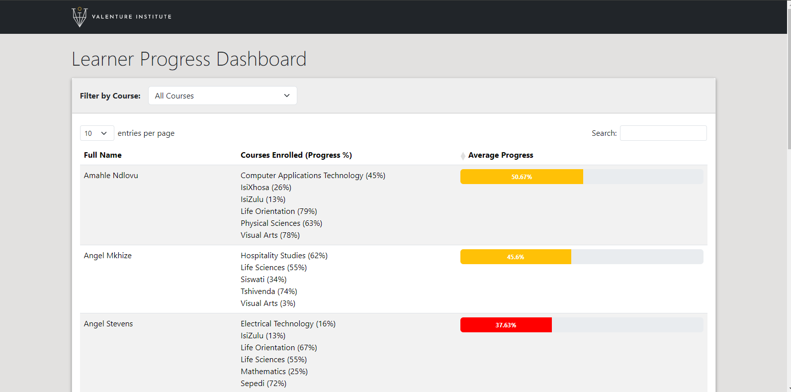

# 🎓 Learner Progress Dashboard

A simple Laravel 12 web app that displays learner enrollment progress across courses, with filtering, sorting, and test coverage.

---

## 📸 Preview



---

## 🚀 Features

- View all learners, their enrolled courses, and progress
- Filter learners by course name
- Sort learners by average progress percentage
- Progress bars with contextual colors (danger/warning/info/success)
- Fully tested with Cypress end-to-end coverage

---

## 🛠️ Tech Stack

- Laravel 12 (back-end)
- Laravel Datatables (for table rendering and interaction)
- Bootstrap 5 (styling and layout)
- Cypress 12.17.4 (end-to-end testing)

---

## 🧰 Getting Started

### 📦 Requirements

- PHP 8.1+
- Composer
- Node.js & npm
- SQLite (default for this project)

---

### 🔧 Installation

```bash
# Clone the repo
git clone https://github.com/dewaldhugo/learner-progress-dashboard.git
cd learner-progress-dashboard

# Install PHP dependencies
composer install

# Install JS dependencies
npm install

# Compile frontend assets
npm run dev

# Set up .env
cp .env.example .env
php artisan key:generate

# Use SQLite (already configured)
touch database/database.sqlite

# Run migrations and seed data
php artisan migrate --seed

# Start the app
php artisan serve
```

Open [http://localhost:8000/learner-progress](http://localhost:8000/learner-progress) in your browser.

---

## 🧪 Cypress End-to-End Tests

This project uses [Cypress](https://www.cypress.io/) for automated E2E testing.

### ✨ Run Cypress in GUI Mode

```bash
npx cypress open
```

Choose the file:

```
cypress/e2e/learner-progress.cy.js
```

### ⚙️ Run Cypress in Headless Mode

```bash
npx cypress run
```

Cypress version: `12.17.4` (pinned for compatibility)

